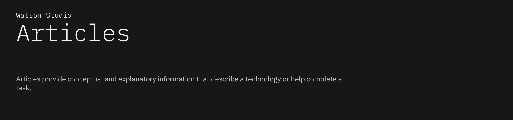

# Articles-Recommendation-on-IBM-Watson-Studio
This repository documents a data science project. In the project, we build a Recommendation System for Articles on IBM Watson Studio.

### Table of Contents

1. [Overview](#motivation)
2. [File Descriptions](#files)
3. [Results](#results)
4. [Environment](#installation)
5. [Data Source](#source)
5. [Licensing](#licensing)

## Overview

In this project, we analyze the interactions that users have with articles on the IBM Watson Studio platform, and make recommendations to them about new articles we think they will like.  

To this end, we explore different approach of recommendation:

- Ranked-based Recommendation （“Popular/Trending...”）.
- Neighbor-based Collaborative Filtering (“People Like You Also Viewed...").
- User-Item Collaborative Filtering.
- Content-based Collaborative Filtering. ("Based on your reading history...")

## File Descriptions 

- Notebook 1: Data Collection, Cleaning, and EDA.

- Notebook 2: Rank-Based Recommendations and Neighbor-based Collaborative Filtering.

- Notebook 3: Collaborative Filtering: Matrix Factorization. (To be added.)

- Notebook 4: Content-based Recommendation. (To be added.)

- Data: a folder contains initial/experiment user and articles Dataset.

- 1_data_df, 1_data_df_content: two pickle files that caches the data processed in 1_Notebook for later use.

- helper_FunkSVD: A python file contains a function implementing (vectorized) FunkSVD for matrix factorization.

## Results

(To be delivered.)

## Environment 

- The Anaconda distribution of Python3.
- Jupyter Notebook.  

## Dataset Source and Acknowledgement 

This project was inspired by the Udacity Data Science Nanodegree Program.

The initial dataset was provided through the program, thanks to the IBM Watson Studio API.

## Licensing 

 You can find the Licensing for the dataset and other descriptive information in the link above.  Other than that, feel free to use anything here as you would like!
